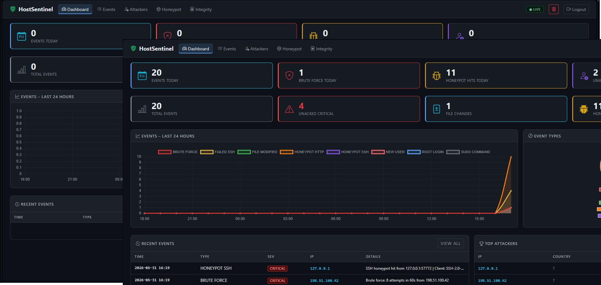
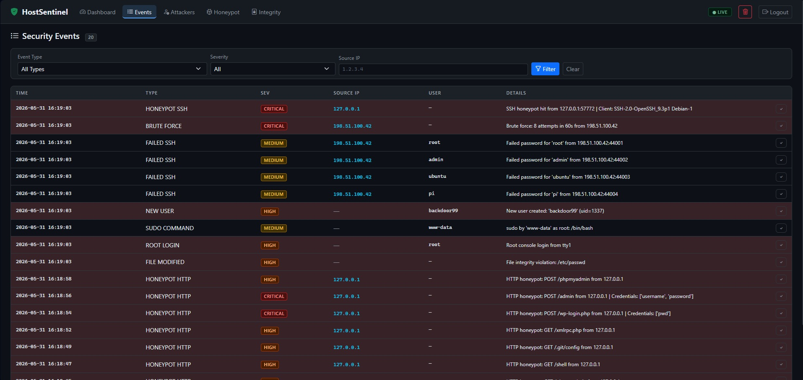
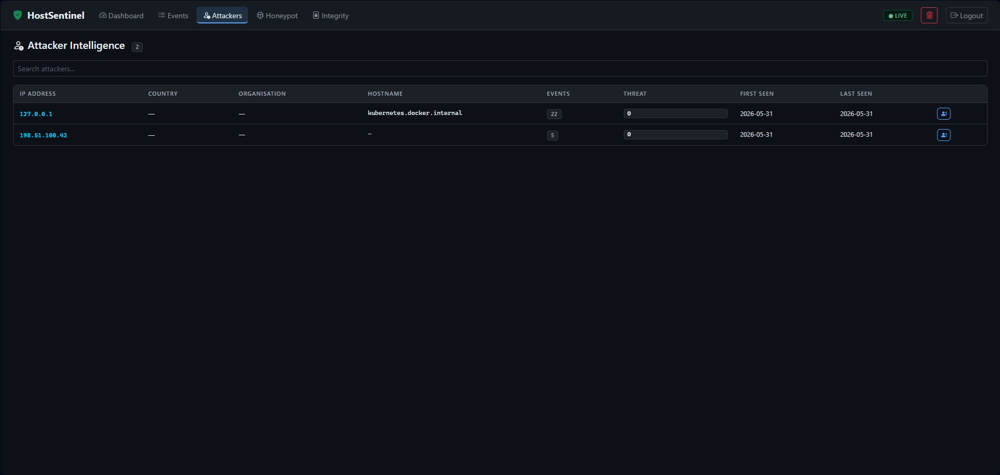
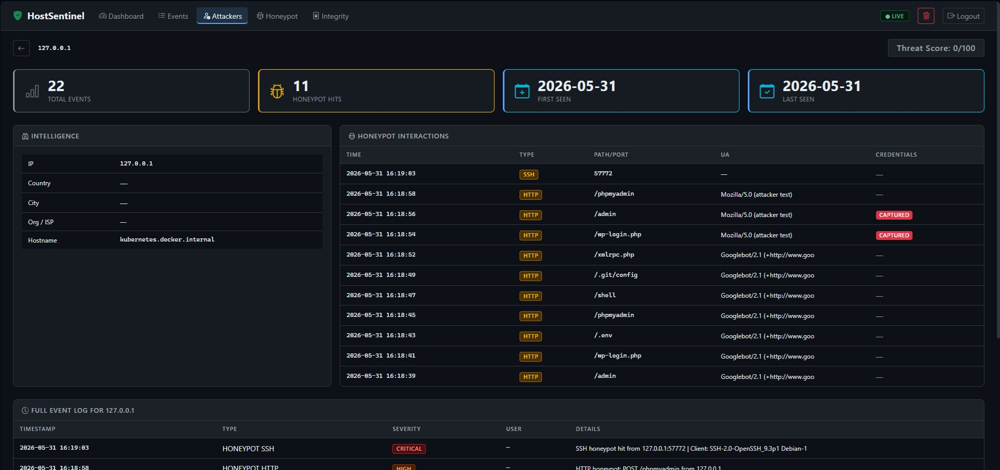
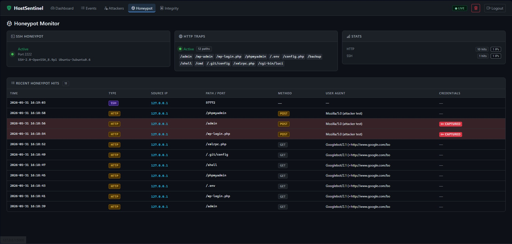
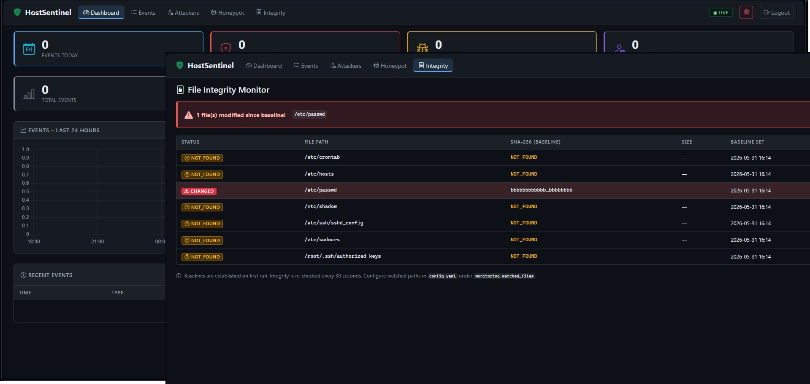
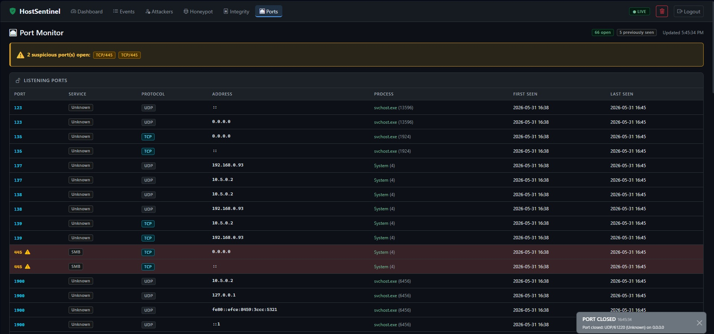

# HostSentinel

A lightweight, production-ready Intrusion Detection System for Linux VPS servers.
Built with Python 3.11+ and Flask. No ML, no heavy dependencies — just clean,
efficient threat monitoring with a real-time web dashboard.

---

## Why It Stands Out

- **Honeypot integration** — fake SSH server and HTTP traps capture attacker
  tools, credentials, and client fingerprints in real time
- **Attacker intelligence** — automatic GeoIP, reverse DNS, and WHOIS enrichment
  with per-IP threat profiles
- **Server-Sent Events** — live dashboard updates without polling or WebSockets
- **Zero cloud dependency** — runs entirely on-VPS, SQLite-backed, no API keys required
- **Tarpit support** — the fake SSH server deliberately delays scanners to waste
  their time and gather more data
- **systemd-native** — ships with a hardened service unit file
- **Email & Discord** — sends live feed to email or discord.

---

## Features

| Feature | Details |
|---|---|
| SSH brute-force detection | Configurable threshold & window; per-IP attempt tracking |
| File integrity monitoring | SHA-256 baseline; 30-second re-check cycle |
| New user / privilege detection | `useradd`, `groupadd`, `sudo`, root login |
| SSH honeypot | Fake banner, tarpit delay, client version capture |
| HTTP honeypot | 12 trap paths; credential capture on POST |
| Attacker profiles | GeoIP, rDNS, WHOIS, threat score, full event timeline |
| Alerts | Email (SMTP) + Discord webhook |
| Dashboard | Live feed, charts, filterable event log, file integrity view |
| Port Viewer | Live feed of all currently opened ports with traffic monitoring |

---

## Quick Start

```bash
# 1. Clone and enter
git clone https://github.com/JonathanOB/HostSentinel
cd HostSentinel

# 2. Create virtual environment
python3 -m venv venv
source venv/bin/activate

# 3. Install dependencies
pip install -r requirements.txt

# 4. Edit config
nano config.yaml          # Set secret_key, auth password, alerts

# 5. Run
python run.py
```

Open `http://localhost:5000` — default credentials: `admin` / `admin`

> **Change the password** in `config.yaml` before exposing to a network.

---

## Installation on a VPS (Production)

```bash
# Create dedicated user
sudo useradd -r -s /sbin/nologin -d /opt/hostsentinel hostsentinel

# Deploy
sudo cp -r . /opt/hostsentinel
cd /opt/hostsentinel
python3 -m venv venv
venv/bin/pip install -r requirements.txt

# Allow reading auth.log
sudo usermod -aG adm hostsentinel

# Install & start service
sudo cp host_sentinel.service /etc/systemd/system/
sudo systemctl daemon-reload
sudo systemctl enable --now hostsentinel

# View logs
sudo journalctl -u hostsentinel -f
```

---

## Running as a systemd Service

The included `host_sentinel.service` file assumes the app lives at
`/opt/hostsentinel`. It runs as a dedicated low-privilege user with
`ProtectSystem=strict` and only grants write access to `data/` and `logs/`.

The service user is added to the `adm` group so it can read `/var/log/auth.log`.

---

## Configuration Guide (`config.yaml`)

```yaml
sentinel:
  host: "0.0.0.0"     # bind address
  port: 5000
  secret_key: "..."   # CHANGE THIS

auth:
  username: "admin"
  password: "..."     # CHANGE THIS

monitoring:
  auth_log: "/var/log/auth.log"
  brute_force_threshold: 6   # attempts before alert
  brute_force_window: 60     # seconds
  watched_files:             # files to hash-check
    - /etc/passwd
    - /etc/shadow

honeypot:
  ssh:
    port: 2222
    tarpit_delay: 2    # seconds delay to slow scanners
  http:
    trap_paths:
      - /admin
      - /wp-login.php
      # add more as needed


alerts: # add SMTP and Discord webhooks to have live alerting.
  email:
    enabled: true
    smtp_host: "smtp.gmail.com"
    ...
  discord:
    enabled: true
    webhook_url: "https://discord.com/api/webhooks/..."
```

---

## Security Considerations

- Change `secret_key` and `auth.password` before deployment
- Run behind a reverse proxy (nginx/Caddy) with HTTPS
- The honeypot SSH port (default 2222) should be publicly accessible;
  your real SSH should be on a non-standard port
- HTTP trap paths must not overlap with your real application routes
- The dashboard itself is not rate-limited — add nginx `limit_req` if exposed
- `data/events.db` contains captured attacker data — protect it accordingly

---

## Screenshots
(Simulated Data from simulate.py)

1. Main Dashboard


2. Events Monitor


3. Attacks Overview 


4. Attacker Specific Details


5. Honeypot


5. Integrity Monitor (*files not found running on windows. Works where files are found*)


5. Ports Monitor

---

## Project Structure

```
hostsentinel/
├── app.py               # Flask app factory + SSE stream
├── run.py               # Entry point
├── config.py            # Config loader
├── config.yaml          # All settings
├── models.py            # SQLite schema + context manager
├── utils/
│   ├── monitor.py       # Auth log tail + file integrity threads
│   ├── honeypot.py      # SSH honeypot + HTTP trap factories
│   ├── parser.py        # auth.log regex parser
│   ├── db.py            # All database operations
│   ├── alerts.py        # Email + Discord alerting
│   └── intelligence.py  # GeoIP, rDNS, WHOIS enrichment
├── dashboard/
│   ├── routes.py        # Flask view routes
│   ├── api.py           # REST API endpoints
│   ├── templates/       # Jinja2 templates
│   └── static/          # CSS + JS
├── data/                # SQLite DB (gitignored)
├── logs/                # App log (gitignored)
└── host_sentinel.service
```

---

## License

MIT

## Disclaimer
This tool was created as a project for a portfolio and has not been tested in a live threat environment. Use at your own discretion.
